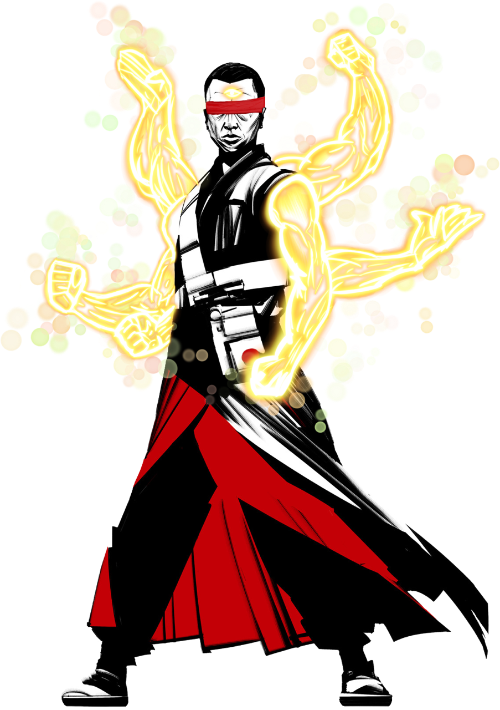

[Zachariah]: /assets/und-paladin.webp
[pc]: #player-characters
[npc]: #non-player-characters
[Ling]:/assets/ling.png

# Hallowed Hills

# TOC

- [Session 1](#session-1)
- [Session 2](#session-2)
- [Session 3](#session-3)
- [Session 4](#session-4)

### Player Characters

 - <details>
    <summary>Zacariah Burch</summary>
    
   </details> 

 - <details>
    <summary>Ling</summary>
    
    
   </details> 

 - Maeve
 - Yurin
 - Boomer
 - Krrven
 - Ling Quan
 - Basil

### Important Notes


## Session 1 

> 4/15/23 _The Crew_

Linq asks for a simple tea and boomer decided to join him. "I really want to see how you drink with your feet bro." Krrven takes a look around (13 perc) and notice the bar is heavily guarded. Maeve retired to her room. 

Yurin played with the band on stage for a bit. Once Yurin steps down an energy takes control of him; Yurin has been cursed by a witch because of the spawn he has abandoned. He is currently cursed with less perception (-2) and more acrobatics (+1), and walks up on stage and says "Hey thats a lot of people," the band looks at him and asks "Are you alright?" Yurin responds "Yea I'm fine stranger danger."

Zach walks up to the bar and adjusts his hand and reattaches to his wrist (14 med) allowed the skin the graft together. 

Morning comes and we meet back in the bar, Krrven grabs some food. Boomer comes down with a strong stench, Morgen comes in to ask of our status. Boomer attempts to offer some of his mushrooms (8 pers) and says "Merry Breakfast." Morgen clearly ignores him and turns to Maeve "So what do you plan to do today." Maeve pleads that we have no where near enough information to be effecient with this operation. Morgen explains some more information but then claims "I trust you but don't know much about your crew, so you'll need someone I can trust more, and he waves over to Basil (Chad).

Basil - well connected Yuan Ti sorcerer. Best friend was doing time and he's looking for some answers. Has two large arms with a snake tail bottom. His crew are usually all named after herbs. Morgen then leaves after introducing us.

We walk as a group over to the bakery. The sign just says "The Bakery." Maeve asks for the main baker, the baker at the front confused at first waves us to the door at the back. Before the group walks into the back room, Krrven asks for a biscuit and a raven rams into the glass window. Zach walks out to see the bird has turned back into the statue he found on his tombstone. 

In the back room of the bakery Boomer attempts to offer (3 pers) "The Baker" some mushrooms. Baker walks over and looks through a giant file drawer and asks what we are looking for. He explains the proprietor of the building is Jack and he recently came into some wealth. Maeve tries (2 pers) to discern more into what the Baker is trying to explain. Krrven asks who runs the city the Baker explains Moe runs the east side, Hans and Grits run the north side, Valeria runs the south, and Jack and "Humpty" is fighting for the west side. Krrven notices a potential secret entrance in the blueprints. Zach asks about the motives of these kingpins and is detailed how Moe seems to look out fo the people, Valeria is vain, and Jack is kind of selfish. 

The Baker then asks, "Now for my part, what will my cut be for this info? I usually ask for 15%." Basil asks "Lets make it 13% and call it a Baker's dozen." The Baker giggles like a school girl and says alright. Basil leads out some info (pers 11) about the job so his crew can know whats going on. Zach asks his statue bird to see if he can inspect Jack's office (animal 6), the statue turns into a raven and flies in the opposite direction. 

The group walks out of the bakery, Maeve asks (18 pers) about any regulars and Jacks, we are informed of two of them. We taxi two carriages to head to the west side of the city. This area of the city is a bit more fanciful. The two names we encounter are Daldir, a fancifal partier, and Vax a drunkard. The gang rolls investigation to find Vax (8,16,15,7...some other crap rolls) and find him at a rundown bar. Vax has a couple piercings, some tattoos, and a full gold set of teeth, he looks wasted. Vax is sitting across the bar from the bartender just reading from a book. It is noon. Maeve offers to buy Vax some more whiskey (4 silver). Vax offers to get Maeve on the list for the night. Zach asks Vax how the local community is and how Zach is in the scene (18), Vax echos the same sentiment that the Baker disclosed. 

Krrven walks around the stock and takes note of what he sees and finds some guards out front and approaches them. "Hey you guys taking a smoke break?" Krrven tries hard to be chatty with them (1 pers) and the guards respond "You can find out what happens here TONIGHT if you want," as they turn to close the door behind them and enter the bar. Zach's bird flies back to him and lets out a "Squak! (I found it),"  and thats it, just staring at him.

We all start to look for Daldir investigations (3,16...some other crap rolls). After a couple hours we have no luck trying to find him. 

Krrven stakes out over a while (18 invest) and notices a couple of people go in and out of the building. 

## Session 2

> 4/23/23 _Day 4 the price of gold_

The crew waits until night time. Zach dresses up like eyes wide shut, cloak covering whole body, and a mask. Basil is wearing snakeskin...as a snake. We are extensively worried if this is a gay bar.... We approach the bar see a goliathe barbarian, an orc, and a tiefling. Basil tries to cut ahead of the line (charisma 23) and the tiefling makes eye contact with him and stops him and says "Omg Basil how are you?!" Basil (14 history) recalls this is Clarissa and knows that shes been working in the area. They have a VERY CHEEKY conversation and then lets Basil in. Boomer (charisma adv 15) and Krrven (charisma adv 16) walk in with Basil, Clarissa offers to catch up with them later. Maeve walks to the front of the line, brings up that she is on the list, Clarissa asks for her +1 and comes in with Yurin. Zach will not create any disorder so he walks to the back of the line. We all make it inside. 

We scan around the room, see a bar to one end, and a staircase in the middle wrapped around a column. Boomer takes a look around (perc 15) and takes notice of more of the well dressed people are ascending the spiral stairs in the middle. With noticing this we all head up the spiral stair case to the 2nd floor and we notice some guards standing to the stairs heading further to the 3rd floor. Group Charisma roll (7,7,0,7,7,22,23) to approach the 3rd floor stairs. The guards look at Maeve and query "They with you?" Basil responds "Never ssseen them before." The bouncer blocks everyone except Basil and Maeve from ascending. Ling tries to go up and the bouncer has to physically touch him and realize he can't see and goes "Oh sorry, yea you can't go up there." On the 4th floor Basil requests to talk to the GM. On the 3rd floor, Ling walks to the dancer floor (perf 16) and kills it. Zach tries to converse with the bartender (7 pers) and gets told that the area the guards are covering are VIP and theres nothing that can be done to get further up the stairs if they don't let you up. Yurin tries to start a fire (20?), but slaps the bartender with his flute. The bartender yells for security, two guards start to approach Yurin while the rest attempt to flee up the stairs. Yurin (17 perf) plays the "I'm sorry" song and stuns the guards in confusion. The guards then start to guide Yurin to the exit, Ling helps Yurin by being a spectacle dancing, and the crowd bumps into the guards freeing Yurin into the crowd. "Time to hit the dusty trail" - Zach says loudly as he turns and walks up the stairs that are currently unguarded. Ling hearing this quickly follows. As we walk up we see guards rushing down looking for a patron that just punched an employee. 

We are all on floor 4 now. We notice a door to the next level that has a lock on it. Ling continues to dance on this floor (10 perf), the music stops. Basil (soh 18) attempts to pick the lock, and opens the door. We walk to the 5th floor (group stealth 7, 12, 20, 20), we hear voices from a covered floor. We see a gentleman with curly brown hair behind a desk, "Look we did a shitty deal, we'll pawn it off."  "Mother goose sent us" - Basil (desception dis 8). We roll INITATIVE.

```
Zach 20-1
Krrven 20
Maeve 13
Ling 17
Yurin 14
Basil 10
Boomer 20+3
```

_COMBAT_

Boomer wild shapes into a spore cloud gaining 12 temp hit points and walks up to one of the guards. Krrven uses crimson rite on his blade (takes 4 damage to himself) and blood comes out from his arm surrounding his blade, then moves and attacks a guard (15), and does 8+4 slashing and 1 cold damage. Krrven lessens his blow so the guard does not take fatal damage, instead he falls unconscious. Zach walks up to the guard on the left yelling "This doesn't need to happen," and casts Armor of Agathys on himself. The guard Zach was standing next to takes action and tries to strike Zach (rolls 17) misses and takes 5 damage from Armor of Agathys. Another guard comes by and tries to hit Zach (rolls 15) gets parried and hurt by another shard from Agathys taking 5 damage. A 4th guard approaches Krrven walking by Boomer activating Boomer's Halo of Spores by fails to land on the guard. The guard then struck Krrven for 5 damage. Ling sprints across the room, summons six spectral arms, and attempts to grappel the boss man.  (11 vs 17) Linq fails to grappel him, Jack sees him coming kicks out his chair to bounce away. Yurin hides behind a chair and casts bardic inspiration on Maeve. The druid near Linq casts entagling root on Linq (14 save), as two giant roots appear out of the floor and fail to snap on him and he jumps out of the way. Basil hides behind a table near Yurin, and attacks the guard next to Zach (15), and does 7 damage with Icy touch. A phantasmal hand grasps the guards throat and renders him unconscious. Maeve tries to reach out to Jack "Before this goes any further, lets see if we can make a deal?" (pers 15). Jack becomes intrigued by the idea of a trade. Maeve comments you don't want this combat to go any longer (18 intidimation), and seems to convince Jack there is some value in halting this rough housing. Boomer walks up to the 2nd guard near Krrven and casts shillelagh on his club and swings at the guard, (22 hit) and deals 8+6 damage to him knocking him out. Boomer and Krrven run to the guard near the table and Krrven attempts to swing at him (flanking 17 hit) and deals 5+4 damage to him. Zach looks at the one guard who tried to hit him and tells him "Is this really wise to continue?" the guard drops his weapon and flees down the stairs. Zach then walks over to the druid and swings his maul at him (13 hit) dealing 4+1+3 damage. Ling attempts to grip again (8) and Jack easily jukes it. Ling uses a ki point and uses flurry of blows to attack the druid (21 16 hits) dealing 5+6 force damage to him rendering him unconscious. Yurin sings the "Sorry I fucked your wife song" (Viscious mockery) on the druid (7) and misses, then casts Bardic Inspiration on Ling. After seeing all this carnage Jacks leans back and says "Alright, alright, you got it." 

_COMBAT OVER_

Basil (18 intidimation) yells at Jack "You gonna give us the egg hard boiled, or over-easy?" Jack points over to a chest that has a magical aura around it, casts a spell on it dispelling it and says "There fine its over there." Opening the chest we find a smooth golden egg, Basil lifts it up using mage hand.
Where did you get this? - Basil
I was just told to. The whole humpty dumpty thing wasn't an accident. You can't let anyone else know that I told you this. The City Guard. -Jack
The kings men said they put him back together - Krrven
They are liars. They know the route, they passed the wall. - Jack
I'll make this look like an accident so you won't get blamed - Basil

Jack hand Basil a note with a royal guard stamp on it. It details the route where the egg was passed through. 

Time for you to visit the Sssand man - Basil as he casts sleep on Jack. Jack slumps over in the chair - out cold. 

Rummaging through the chest we find 150 silver and a stylish satch (a bag of holding). Krrven rummages through the drawers (perc nat 20) and remembers to go back and lock the door after making all the noise, then also finds a elevator in the back. Krrven also finds another 2 gold, 15 silver, and a black envelope with some dried substance (possibly blood) in the shape of a heart on it. The envelope contains a black piece of paper with white lettering that has an address to the kings guard. Krrven puts it back together into the drawer he found it. Ling tries to rummage through the bodies (3 investigation) and fails to find anything. The stair door starts to rattle, Basil tries to rummage through Jacks pockets (sleight of hand 11 disadvantage) and wakes him up and Jack yells "HELP." We all go to the elevator, as it starts to move we hear the doors rattle more and burst open. The elevator opens up to the kitchen area of the bar. We all leave through the kitchen unnoticed. Basil stops to try to cast prestidigation on some of the sauce and help the cooks, this causing them to rage - we all ignore this and leave. We all escape into a carriage (14 perc) and drive off into the night. We decide to sleep on it rather than turn the egg back in to Moe's immediately. 

We take a long rest.

## Session 3

> 5/7/23 _Connections_

Our carriage pulls up to the brick house. We all exit the carriage and the carriage leaves the scene. Boomer walks up to the doorman, hands him a mushroom, and walks in. We all follow and see all the tables set with overturned chairs on top of them and a cleaning staff working. Boomer orders a white russian from the bar and sprinkles his crushed mushrooms on it. Maeve asks where Moe is, the bartender says he isn't currently around, but should be back in the morning. We all turn in for the night. As we all come down Moe's men wave that they are ready for us. We all ascend the staircase to see Moe in a room motioning us to sit around him. Moe asks for the egg, Maeve pulls it out from the bag of holding. 
I had my doubts, but you guys came through for me. Total transparency I had eyes on you guys and couldn't tell the status of the job. As agreed 13% will go to the baker. Looks like about 150g for each of you. Any details? - Moe
We taught Jack a lesson to not mess with Moe - Basil
Is he down for a long nap? - Moe
It's just a lullaby you know? - Basil (12+5 pers) 
I tell you what, this is good to hear. You guys provide results. I will extend you an offer, as a part of this union. I will grant protection as long as you do my work. - Moe
Moe hands us these badges (look like cogs) and says "You can show these to anyone in the area and they will know you are a part of the union."
We decide to walk around the city and boomer (1-1 investigation) tries to find a potion shops and ends up in the middle of no where in the city. 
Krrven tries to look for a leather shop (19 investigation), with the help of the concierge and knowledge of the local area finds an armor shop. Krrven tries to bargain with the armor keep (8 persuasion). The patron offers 180g, Boomer offers to give Krrven 30G. Krrven hands over the 180g. 
Yurin tries (4 investigation) to look for potions and completely forgot what the concierge said. 
Catnip finds Basil.
Is there any new information on the union? - Basil
Whatever you did the boss is pretty happy with, what did you guys do exactly? - Catnip
We can't discuss this in public - Basil
Word is you guys punked Jack. Weird thing is, no one knows what you guys were fighting about. They are saying they don't want anything done about it. - Catnip
I will reach out to the crew and find out what else they know. Keep all eyes and ears out for EV. - Basil
A group of people with 8 point star badges on them approach the our group.
Halt, identify yourselves. High Captain Moriss commands it.
Maeve (11 persuasion) tries to tell them they have no interest in us. 
I'll decide what I have interest in - Captain
Basil casts suggestion - We're on the same side, you can devistate our operation if you blow our cover. Let us be.
The Captain slowly turns and mumbles - the hand is everywhere. Then says aloud Alright be on your way. 
We all go back to Deloris's house. Zach and Deloris have a little talk on her porch, Deloris tells Zach that his armor reminds her of a museum that shows similar symbols that are shown. 
Yurin (arcana check) feels one soul rip him out of his body. Yurin feels a bit moody as Thomas takes over his body (-1 charisma, +1 intimidation). 
Boomer (8-1 nature) can tell his mushrooms are trying to converse with him but is unable to tell how or what. Boomer tries to grow the mushroom (10-1 nature) and still can't understand what the mushroom is trying to say. Boomer tries to explain how these mushrooms can have different personalities. 
Zach tries to look (2-1 investigation) for a church. Quickly realizes the whole town is so different and ends up completely overwhelmed so just walks back into the house. 
Maeve converses with the bartender at Moe's - When we getting another job?
Word on the street is you guys are efficient. We may be getting a job for some collection. - Bartender
You have no idea where these jobs are coming from? - Maeve
Honestly, no. The funding for these seem to be coming from pretty high up - Bartender
Krrven (14 arcana) meditates in Deloris' apartment and feels a crawling sensation go up his spine. He (20 survival) can tell that it's just a wave that passes through all of us coming from the center of the city. Krrven tries to look around and see if anyone has any reaction to the wave. 
Did you feel that? - Krrven to Zach
I don't feel much anymore lately - Zach
Did you feel that? - Krrven to Deloris
Feel what? - Deloris
Do you know what they do at the center of the city? - Krrven
They hustle and bustle, they also say there may be some old magic there - Deloris
Deloris explains a bit of the history of the city. How there was a gap in the history, there was a patron that collected the people and worked to coallesce into a town. There were also whispers of magic helping aid the transition.
We decide to head to the heart of the city, after thanking Deloris for the evening. Basil breaks from the group to blend into the crowd. Krrven (9 arcana adv) tries to check where that wave came from. Yurin walks to Krrven thinking he needs bardic inspiration but the spirit of Thomas tells him "eh fuck him" and walks away instead. Boomer (17 nature) feels pulses coming from the mushrooms that feels like it's saying "Danger" constantly pulsing. Boomer takes the mushroom out of his pocket and places it into a plant nearby, he can feel the pulses are coming from the middle of the city.  Boomer relays that info to the group.  Krrven (18 arcana) tries to recall the history of the area, and remembers with Deloris reminding him partially, that there was chaos in this area before a leader harnessed this energy. 
Basil (19 investigation) tries to mingle with the crowd and pry information about the main hub of the city. He finds that being able to get into the main city you would have to be well off, or have a connection, but also that there is a security detail that is always looking for new bodies. From this Basil determines he needs to reach out to Saffron, since he would have a way in to the higher rung of society, but doesn't know how to contact him at the moment.

The group (Charisma save 8,14,13,17,21,1) find we are being tailed by the kings guard. Sensing this we decide to hop in our carriage and head back to the brick house. 

## Session 4

> ?/?/23 _?_
